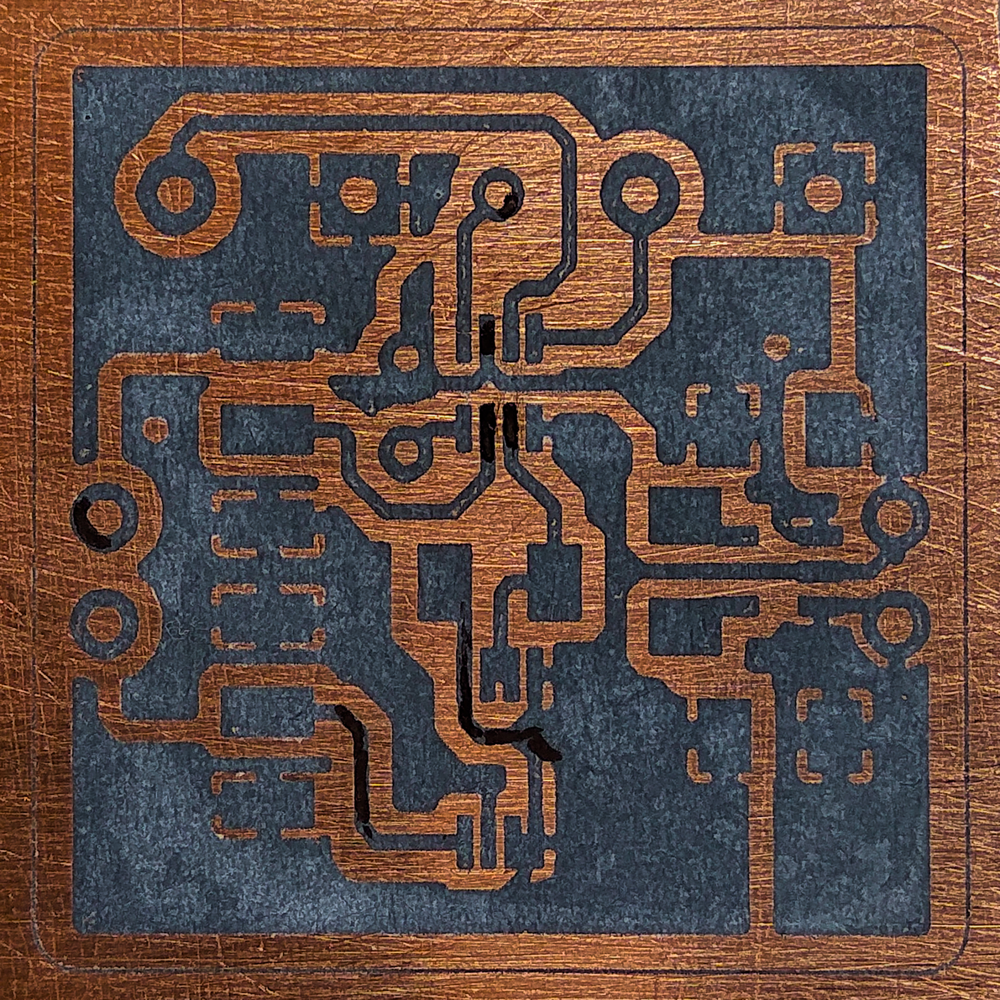
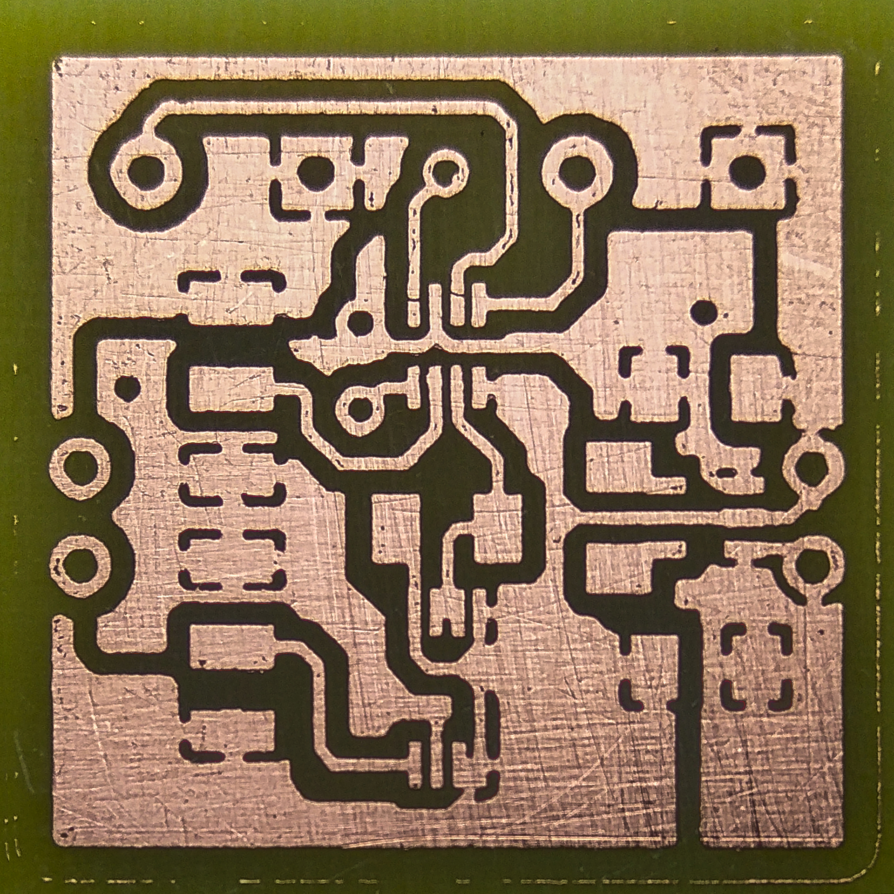
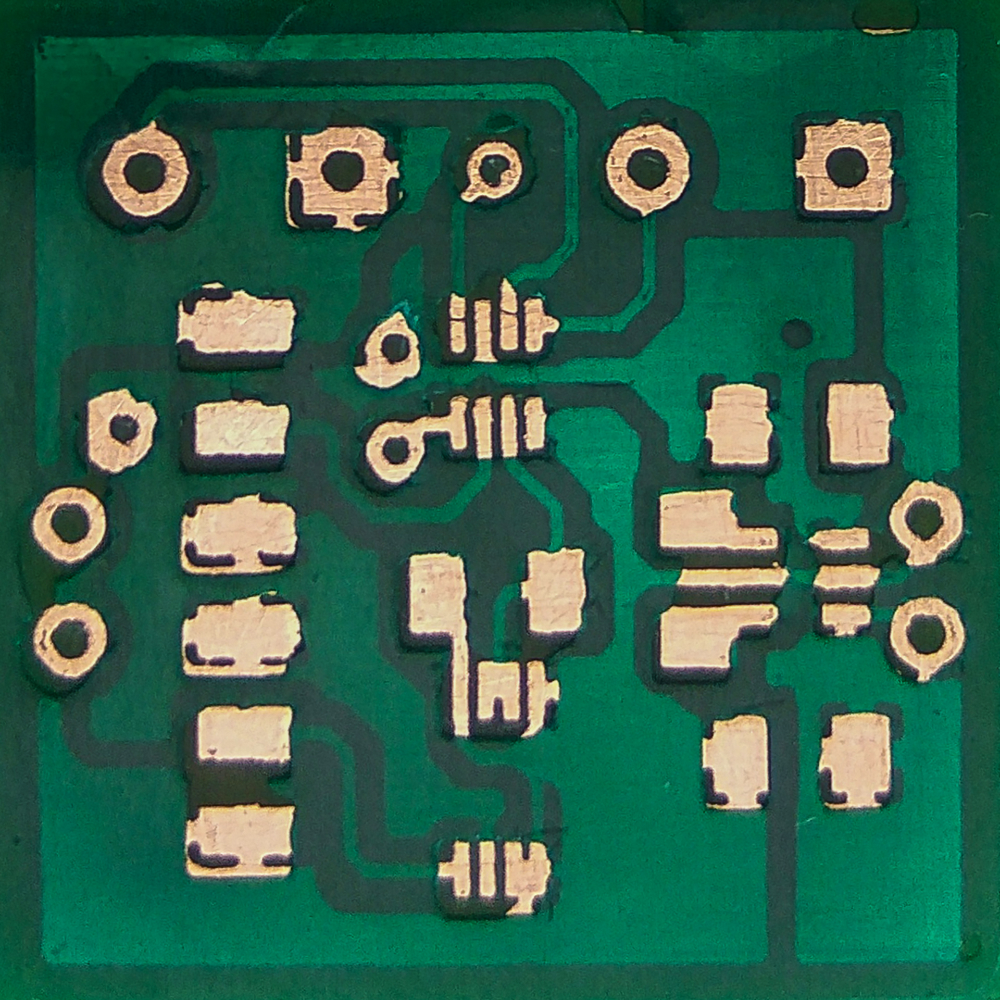
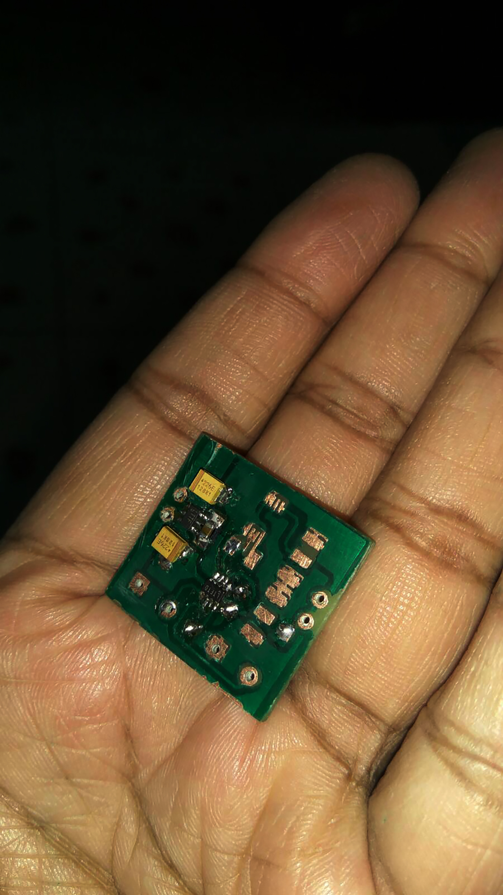

<h1 align="center"> Arduino miniDAC Module </h1>  

## Table of Contents
- [About](#About)
- [Feedback](#feedback)
- [License](#license)
- [Acknowledgments](#acknowledgments)

## About

**Arduino miniDAC Module** is a unipolar digital to analog converter (DAC) module built arround [LTC®2633](http://www.linear.com/product/LTC2633), which is a family of dual 12-, 10-, and 8-bit voltage-output DACs with an integrated, high accuracy, low drift reference in an 8-lead TSOT-23 package.
 These DACs communicate via a 2-wire I2C-compatible serial interface operating in both the standard mode (clock rate of 100kHz) and the fast mode (clock rate of 400kHz).
 It is compatible with both 3.3V and 5V logic levels and uses [LTC2633](https://github.com/TamojitSaha/LTC2633) library developed by [Tamojit Saha](http://tamojit.tk) and [Sandeepan Sengupta](http://sandeepan.info)

  &nbsp
  &nbsp
  &nbsp

  &nbsp 
  &nbsp

## Social
Connect us here:
  
  
 

 
or <a href ="https://github.com/TamojitSaha/LTC2633/issues/new/">file an issue</a>. Feature requests are always welcome.

## License
Contents of this repository are realeased under [CC-BY-NC-SA 4.0](./LICENSE.md)  

## Acknowledgments
Thanks to the contributors! :wink:
